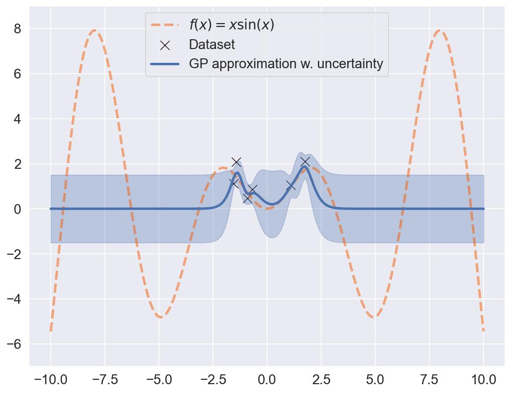

# Some examples of my thesis

This repository contains examples that are used in my dissertation.

## Prerequisites

Install the requirements to run these scripts by running

```sh
pip install -r requirements
```

## Chapter 3

In `Chap_3/running_example.py` you can find an example of Gaussian Process Regression on the function $f(x) = x\sin(x)$. It is trained using `botorch`'s `SingleTaskGP`.


This example allows us to show how a GPR returns to the prior away from the support:



## Chapter 6

In `Chap_6_and_7/vae.py` you can find an implementation of a Variational Autoencoder (VAE), trained only on the digits 1 of `MNIST`. It illustrates how a VAE lacks proper uncertainty quantification, since the variance shown in `latent.jpg` is low away from the support.


## Chapter 7

`Chap_6_and_7/vae_geometric.py` shows how we can modify a VAE to have better uncertainty quantification.


